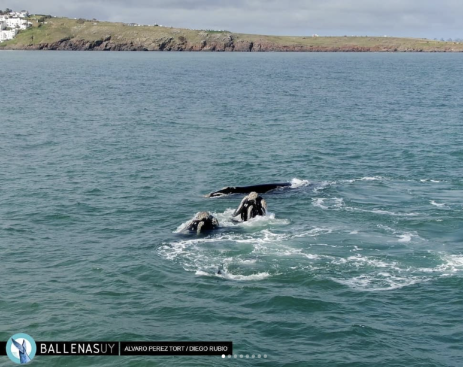

<div style="text-align: center;">
    
</div>

> Actualmente en Punta Ballena se desarrollan numerosas actividades turístico-recreativas como pesca, parapente, rapel, senderismo, observación de plantas, visitas a las cuevas y grutas, buceo y snorkeling, venta de artesanías. También es un lugar muy apreciado para contemplar el paisaje y el atardecer. Adicionalmente, se utiliza para la observación de aves y ballenas, especialmente durante la temporada en que la ballena franca **Eubalaena australis** visita las costas uruguayas.

Extraído de *Comentarios al Informe Ambiental Resumen del “Complejo Residencial Punta Ballena”* presentado en Octubre de 2023
Centro Universitario Regional del Este (CURE), UDELAR. Lo puedes encontrar completo en https://somospuntaballena.org/ tanto en versión escrita (aquí) como en versión audio (aquí).

## Alcance

Este repositorio permite automatizar tareas que vinculan información proveniente de la planilla de gestores de firmas con otras applicaciones como ser google maps y (próximamente) correo electrónico y whatsapp. La automatización de dichos procesos persigue generar ciclos de respuesta rápidos, tanto para la gestión de ingresos nuevos como para la generación de información para el público en general.

Ejemplos de tales productos son planillas con información depurada para ser presentada públicamente, un mapa con puntos de recolección de firmas, el monitoreo automático de información faltante para garantizar cierta calidad de los puntos, entre otros. Se liberan así valiosos recursos humanos que pueden enfocarse en tareas de creación de ideas y coordinación de equipos en territorio.

Para su implementación, este proyecto utiliza [Python](https://www.python.org/downloads/), diversas APIs de Google, entre otras.

## Depuración de información a partir de la planilla de gestores de firmas

La planilla de gestores de firmas tiene la estructura que se describe a continuación.
Por cada departamento del Uruguay, recolectamos los siguientes campos (que se corresponden con columnas en la planilla):

```python
COLUMNS = ['Nº', 'DEPARTAMENTO', 'Barrio/ Cuidad/ Balneario', 'Modalidad de Recolección de Firmas', 'ESTABLECIMIENTO', 'DIRECCIÓN', 'HORARIO', 'Gestora del equipo', 'NOMBRE Completo', 'CELULAR', 'MAIL de contacto', 'CANTIDAD PLANILLAS ENTREGADAS NACIONAL', 'CANTIDAD PLANILLAS ENTREGADAS DEPARTAMENTAL']
```

Es importante destacar que frente a cambios en los nombres de dichas columnas, o agregar o quitar elementos en columnas nuevas, el programa puede requerir una actualización. Por eso es importante utilizar los campos existentes en vez de crear uno nuevo. Por ejemplo, si vemos que un punto en el mapa no es geolocalizado correctamente y lo queremos insertar de forma manual, se puede colocar en la misma celda del campo 'DIRECCIÓN' asi:

```python
'Ruta 10 entre Cruz del Sur y General Gervasio Artigas  https://maps.app.goo.gl/ufnBa5Qywc8ycxD18'
```

Utilizando las hojas de todos los departamento, se generan de manera automática las siguientes hojas:

### `AUTO Todos`

...

### `AUTO Todos Publico`

...

## Generación del mapa por geolocalización

## Exportación del mapa para la web en distintos formatos

Esta funcionalida genera una lista de localidades para firmar la declaración de Punta Ballena como Área Natural Protegida como una lista en distintos formatos de salida: PDF, CSV, Markdown, HTML. 

Utiliza la información proveniente del mapa interactivo que se puede encontrar en https://somospuntaballena.org/ 

```python
% python3 extract_kml_info.py
...
# Ejemplo de salida:
File saved successfully to firmas_2024_02_23_19h_25m_55s.kml
DataFrame saved to output/firmas_2024_02_23_19h_25m_55s.csv
HTML table saved to output/firmas_2024_02_23_19h_25m_55s.html
HTML table saved to firmas_2024_02_23_19h_25m_55s.html
Markdown saved to output/firmas_2024_02_23_19h_25m_55s.md
Markdown saved to firmas_2024_02_23_19h_25m_55s.md
PDF generated: output/firmas_2024_02_23_19h_25m_55s.pdf
PDF saved to output/firmas_2024_02_23_19h_25m_55s.pdf
```
Ver que también se genera un archivo KML con los datos actuales del mapa fuente.

El script también se puede correr en el REPL de Python haciendo

```python
exec(open("extract_kml_info.py").read())
```

---

Este proyecto se ha beneficiado de ejemplos de código y sugerencias proporcionadas a través de interacciones con el programa ChatGPT-4 de OpenAI. Ver https://chat.openai.com/

*Defendamos Punta Ballena. En colectivo somos gigantes.* https://somospuntaballena.org
